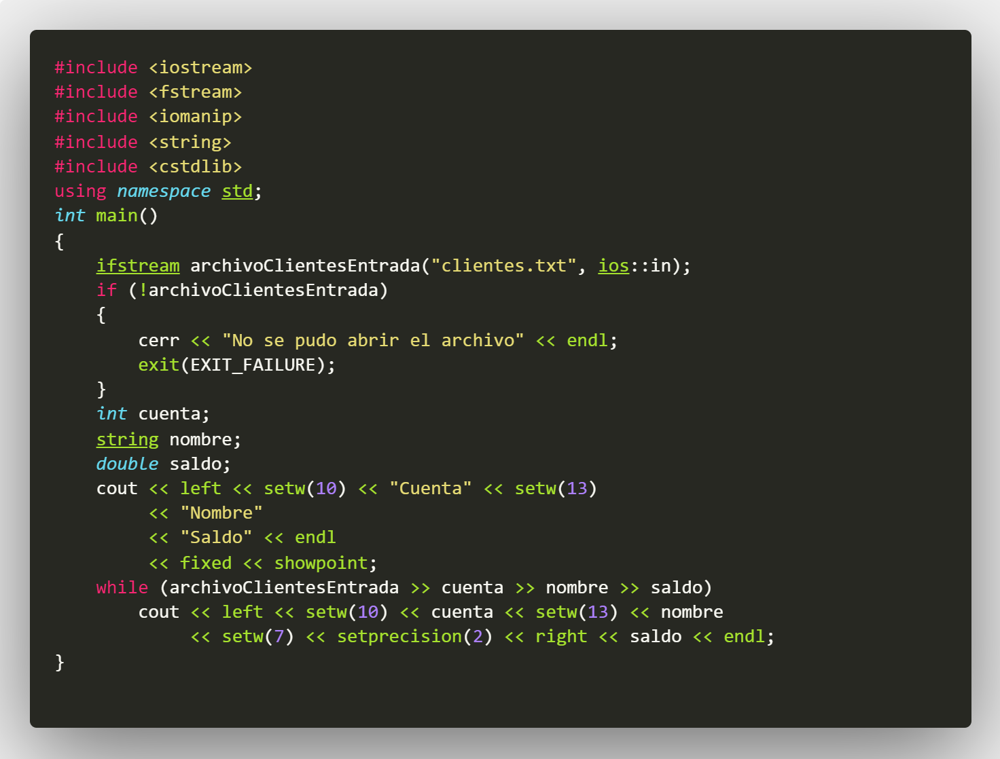
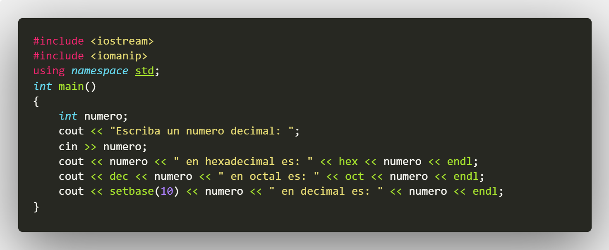

# C_PDC_08_11811045_AndresNuila
## :copyright: Autor

- :camera: 

- :older_man: **Andrés Enrique Nuila Domínguez**
- :e-mail: enuila634@gmail.com
- :link: [github.com/enuila1325](https://github.com/enuila1325)

## ASIGNACION1

#### CPPs y HPPs

---

---

---

---

---

---

---

---

---

---

---

---

---

---

---
#### Salidas

---

---

---

---

---

---

---

---

---

---

---

---

---

---

---

## ASIGNACION2

#### CPP

---

#### Salida

---

## ASIGNACION3

#### CPPs y HPPs

---

---

---

#### Salida

---

### :computer: Código

- :blue_book: [C++_PDC#09_11811045_AndresNuila](https://github.com/enuila1325/PDC_09_C_AndresNuila_11811045)
#### Herramientas:
- :package: [Visual Studio Code](https://code.visualstudio.com/)
- :camera: [Polacode-2020 v0.5.2](https://github.com/jeff-hykin/polacode)
- :notes: [Emoji Cheat Sheet](https://www.webfx.com/tools/emoji-cheat-sheet/)